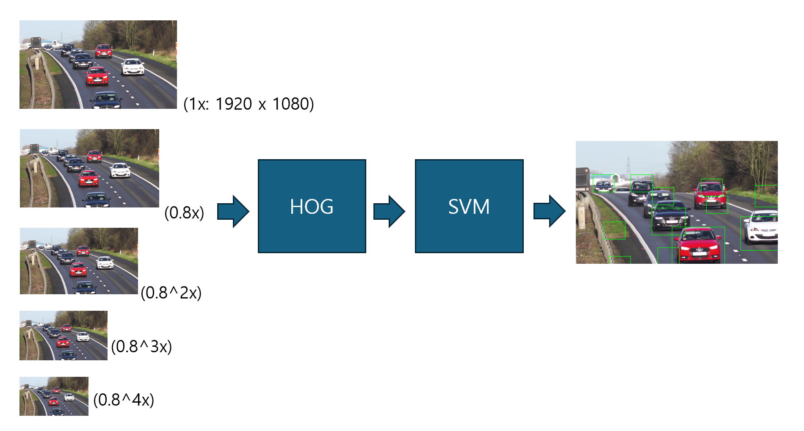
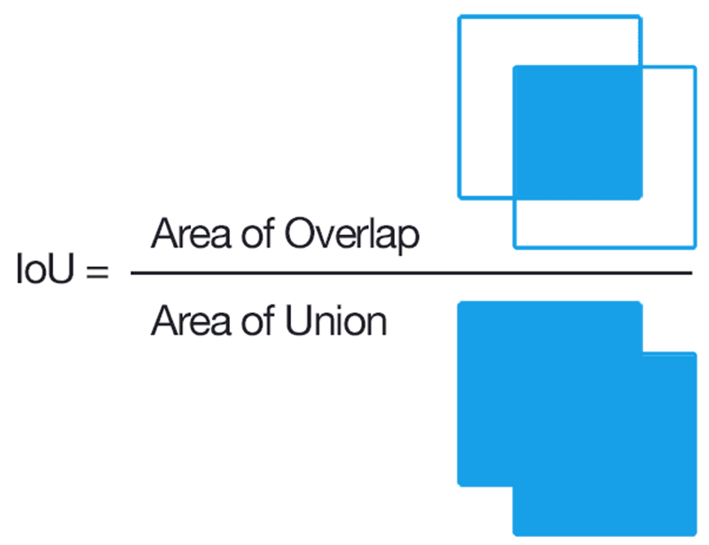

# 1. Introduction

This project focuses on the development of a traditional vehicle detection system utilizing Histogram of Oriented Gradients (HOG) for feature extraction and Support Vector Machines (SVM) for classification. The aim is to investigate the performance and practicality of traditional image processing methods in vehicle detection.

HOG is employed to extract structural and shape-related features of vehicles, and an SVM classifier is used to distinguish between "vehicle" and "non-vehicle" regions. While deep learning models often outperform traditional methods in terms of accuracy, this project highlights the potential of classical techniques, emphasizing their computational efficiency and interpretability.

By carefully tuning parameters and evaluating performance on diverse datasets, this project demonstrates the viability of traditional methods in vehicle detection and explores their limitations compared to modern techniques.

# 2. Results

 

The following images are snapshots taken from the result video generated by the vehicle detection system using HOG and SVM.

However, as seen in the images, some non-vehicle regions are also falsely identified as cars. This occurs because the HOG features of those areas closely resemble the structural patterns of vehicles, causing the classifier to misidentify them. Addressing this issue would require further refinement, such as using mroe discriminative feature extraction techniques or incorproating additional post-processing steps.

# 3. Overall Flow

The process begins by **resizing the input image** into multiple scales to account for the varying sizes of vehicles in the scene. For example, cars closer to the camera appear larger, while those farther away appear smaller. To handle this, the image is resized incrementally (e.g., 1x, 0.8x, ..., 0.8⁴x).

.png)
.png)

At each resized image scale:

1. **HOG feature extraction** is performed to capture the structural patterns of potential vehicles.

2. The extracted features are passed through a **pre-trained SVM classifier**, which determines whether a region contains a vehicle. If a region is classified as a vehicle, a bounding box is drawn around it.

However, this approach generates multiple overlapping bounding boxes for a single vehicle across different scales. For instance, if the SVM works perfectly, a single car may have five bounding boxes (one for each resized image).

To address this issue, a **non-maximum suppression** step is applied:

When overlapping bounding boxes are detected by **Intersection over Union (IoU)**, the box with the **highest confidence score** from the SVM (the highest probability of being a vehicle) is retained, while the others are removed.

This ensures that each detected vehicle is represented by a single, most accurate bounding box.

# 4. HOG Feature Extraction
