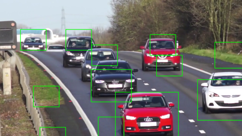
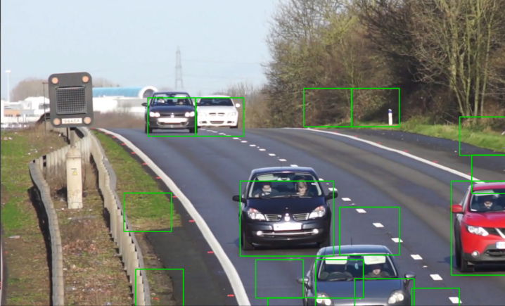

# 1. Introduction

This project focuses on the development of a traditional vehicle detection system utilizing Histogram of Oriented Gradients (HOG) for feature extraction and Support Vector Machines (SVM) for classification. The aim is to investigate the performance and practicality of traditional image processing methods in vehicle detection.

HOG is employed to extract structural and shape-related features of vehicles, and an SVM classifier is used to distinguish between "vehicle" and "non-vehicle" regions. While deep learning models often outperform traditional methods in terms of accuracy, this project highlights the potential of classical techniques, emphasizing their computational efficiency and interpretability.

By carefully tuning parameters and evaluating performance on diverse datasets, this project demonstrates the viability of traditional methods in vehicle detection and explores their limitations compared to modern techniques.

# 2. Results

The following images are snapshots taken from the result video generated by the vehicle detection system using HOG and SVM.

However, as seen in the images, some non-vehicle regions are also falsely identified as cars. This occurs because the HOG features of those areas closely resemble the structural patterns of vehicles, causing the classifier to misidentify them. Addressing this issue would require further refinement, such as using mroe discriminative feature extraction techniques or incorproating additional post-processing steps.

 

