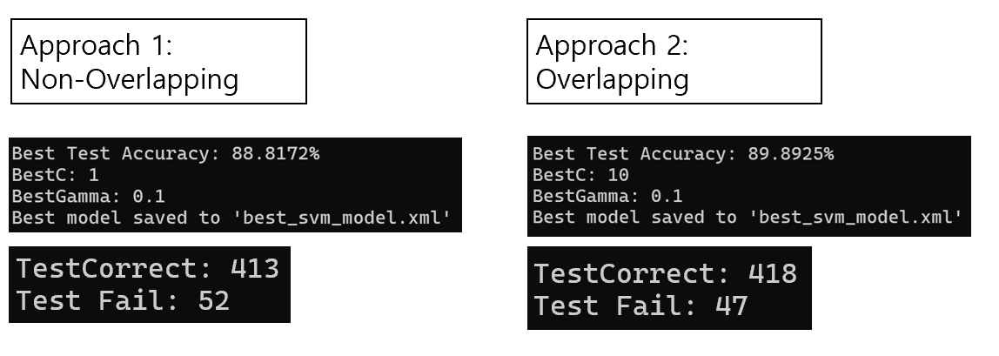

# 1. Introduction

This project focuses on the development of a traditional vehicle detection system utilizing Histogram of Oriented Gradients (HOG) for feature extraction **not using OpenCV functions** and Support Vector Machines (SVM) for classification. The aim is to investigate the performance and practicality of traditional image processing methods in vehicle detection.

HOG is employed to extract structural and shape-related features of vehicles, and an SVM classifier is used to distinguish between "vehicle" and "non-vehicle" regions. While deep learning models often outperform traditional methods in terms of accuracy, this project highlights the potential of classical techniques, emphasizing their computational efficiency and interpretability.

By carefully tuning parameters and evaluating performance on diverse datasets, this project demonstrates the viability of traditional methods in vehicle detection and explores their limitations compared to modern techniques.

# 2. Results

 

The following images are snapshots taken from the result video generated by the vehicle detection system using HOG and SVM.

However, as seen in the images, some non-vehicle regions are also falsely identified as cars. This occurs because the HOG features of those areas closely resemble the structural patterns of vehicles, causing the classifier to misidentify them. Addressing this issue would require further refinement, such as using mroe discriminative feature extraction techniques or incorproating additional post-processing steps.

# 3. Overall Flow

The process begins by **resizing the input image** into multiple scales to account for the varying sizes of vehicles in the scene. For example, cars closer to the camera appear larger, while those farther away appear smaller. To handle this, the image is resized incrementally (e.g., 1x, 0.8x, ..., 0.8⁴x).

.png)
.png)

At each resized image scale:

1. **HOG feature extraction** is performed to capture the structural patterns of potential vehicles.

2. The extracted features are passed through a **pre-trained SVM classifier**, which determines whether a region contains a vehicle. If a region is classified as a vehicle, a bounding box is drawn around it.

However, this approach generates multiple overlapping bounding boxes for a single vehicle across different scales. For instance, if the SVM works perfectly, a single car may have five bounding boxes (one for each resized image).

To address this issue, a **non-maximum suppression** step is applied:

When overlapping bounding boxes are detected by **Intersection over Union (IoU)**, the box with the **highest confidence score** from the SVM (the highest probability of being a vehicle) is retained, while the others are removed.

This ensures that each detected vehicle is represented by a single, most accurate bounding box.

# 4. HOG Feature Extraction (OpenCV x)

To extract HOG features, the magnitude and orientation of gradients are first calculated using the **Sobel edge** detector. The orientation is then divided into 9 bins within the 180-degree range, and a histogram is constructed by accumulating the magnitude values into the corresponding bins. Afterward, L2 normalization is applied to the histogram for better feature scaling.

There are two methods for implementing HOG extraction:

1. **Non-overlapping cells**: the cells within a window do not overlap.
2. **Overlapping cells**: the cells are allowed to overlap with each other.

Both methods share a common limitation: they do not fully cover all parts of the window due to differences in window size and cell size. However, since the windows themselves are set to overlap, this limitation becomes less significant.

# 5. Training SVM

The SVM was trained using the dataset available at this GitHub repository (https://github.com/A2Amir/Traditional-Object-Detection). The dataset contains a total of 2322 images, each with a resolution of 64x64 pixels. Among these, there are 1196 vehicle images and 1126 non-vehicle images.

The data was split into 80% for training and 20% for testing. To enhance the training dataset, data augmentation was applied by horizontally flipping the images within the training set.

During training, hyperparameters C (regularization parameter) and gamma (kernel coefficient) were fine-tuned to select the optimal SVM model for the task.

Two HOG feature extraction methods were compared during the training process:

1. **Non-overlapping cells**: This method achieved an accuracy of 88.8172%.
2. **Overlapping cells**: This method achieved a slightly better accuracy of 89.8925%.

The second method (overlapping cells) outperformed the first one, likely due to its ability to capture more robust features by including overlapping regions. As a result, the overlapping cells approach was selected for implementation.

After completing the implementation, testing was performed using a video from Pexels (https://www.pexels.com/video/cars-on-highway-854671/). The video showcases cars on a highway, making it suitable for evaluating the detection system in a real-world scenario.

# 6. Summary and Limitations

In this project, vehicles were detected by extracting HOG features using a traditional approach without relying on OpenCV functions. While the performance is not exceptionally high, the results demonstrate that the system can detect vehicles reasonably well.

However, several **limitations** were identified:

1. **Sensitivity to lighting and background**: The system struggles in varying lighting conditions and with complex backgrounds.

2. **Overlapping vehicles**: The method for handling overlapping vehicles shows limitations. Although IoU was used to determine overlap, the system often fails to distinguish between overlapping vehicles and multiple bounding boxes on the same vehicle.

3. **Dataset limitation**: The dataset used for training contained only images of vehicle rear views, whereas the test video primarily features front views of vehicles. This discrepancy negatively impacts detection accuracy.

4. **Computational inefficiency**: Since HOG feature extraction was implemented manually without OpenCV functions, the processing speed is significantly slow.

To address these limitations and **improve accuracy**, the following future directions are proposed:

1. **Adjusting the kernel size** to ensure better coverage of each window.

2. **Refining the overlap criterion** (IoU) to more strictly handle redundant bounding boxes.

3. Optimizing the implementation to **increase processing speed** while maintaining accuracy.

Through this project, the challenges and potential of traditional methods for vehicle detection were explored, laying a foundation for future improvements in both accuracy and efficiency.
